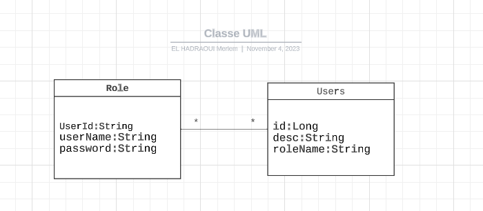

<h1 style="text-align: center;">Rapport de Projet Gestion d'Authentification</h1>

<h2>Introduction</h2>

Ce rapport présente en détail le projet de gestion d'authentification,
qui a été développé en utilisant Spring Boot, JPA (Java Persistence API), 
et Spring Data. L'objectif principal de ce projet est de mettre en place un système
de gestion des utilisateurs et des rôles,
ainsi que de fournir une solution d'authentification sécurisée.

<h2>Conception du Projet</h2>

La conception du projet repose sur deux entités principales :
User (utilisateur) et Role (rôle). Un utilisateur peut être associé à 
plusieurs rôles, et un rôle peut être attribué à plusieurs utilisateurs. 
Cette relation est gérée en utilisant une association Many-to-Many entre 
les entités User et Role.

<h2>Structure du Projet</h2>
<ul>
  <li>Le projet est organisé en plusieurs packages, chacun ayant un rôle spécifique :</li>
  <ul>
    <li>Le package <code>ma.enset.entities</code> contient les définitions des entités <code>User</code> et <code>Role</code>. Ces entités sont annotées avec des métadonnées JPA pour les mappages en base de données.</li>
    <li>Le package <code>ma.enset.repositories</code> abrite les interfaces <code>UserRepository</code> et <code>RoleRepository</code>, qui héritent de <code>JpaRepository</code>. Ces interfaces sont utilisées pour effectuer des opérations CRUD (Create, Read, Update, Delete) sur les entités <code>User</code> et <code>Role</code>.</li>
    <li>Le package <code>ma.enset.service</code> contient l'interface <code>UserService</code> et son implémentation <code>UserServiceImpl</code>. <code>UserService</code> définit des méthodes pour la gestion des utilisateurs et des rôles, telles que l'ajout d'un nouvel utilisateur, la recherche d'un utilisateur par nom d'utilisateur, et bien d'autres. <code>UserServiceImpl</code> fournit l'implémentation concrète de ces méthodes.</li>
    <li>Le package <code>ma.enset.web</code> contient le contrôleur <code>UserController</code>, qui expose une API REST pour récupérer les détails d'un utilisateur en utilisant son nom d'utilisateur. Cette API est accessible via une requête HTTP GET sur l'URL <code>"/users/{username}"</code>.</li>
  </ul>
</ul>

<h2>Utilisation des Annotations</h2>

Le projet fait un large usage d'annotations pour configurer les entités, les repositories, et les contrôleurs REST. Voici quelques-unes des annotations clés utilisées dans le projet :
  - @Entity : Cette annotation marque les classes User et Role comme des entités persistantes, qui sont mappées sur des tables de base de données.
  - @Id : L'annotation @Id définit un champ comme la clé primaire de l'entité.
  - @GeneratedValue : Cette annotation définit la stratégie de génération des valeurs de la clé primaire. Ici, GenerationType.IDENTITY indique que la base de données génère automatiquement les valeurs.
  - @ManyToMany : Cette annotation définit une relation Many-to-Many entre les entités User et Role. Cette relation permet à un utilisateur d'avoir plusieurs rôles et vice versa.
  - @RestController : Cette annotation marque la classe UserController comme un contrôleur REST, permettant d'exposer des points d'API HTTP.

<h2>Configuration de la Base de Données</h2>

Le projet est configuré pour utiliser 
une base de données pour stocker 
les informations des utilisateurs, des rôles, et les relations entre eux.
La configuration de la source de données se fait dans le fichier application.properties, 
où l'on peut spécifier le type de base de données (H2 ou MySQL), l'URL de la base de données,
le nom d'utilisateur, et le mot de passe. Dans ce projet,on a utilisé dans un premier temps H2 puis MySQL.

<h2>Gestion des Utilisateurs et des Rôles</h2>

Le service UserService propose un ensemble de
fonctionnalités essentielles pour la gestion des utilisateurs et des rôles :
  - La méthode addNewUser(User user) permet d'ajouter un nouvel utilisateur en spécifiant son nom
d'utilisateur et son mot de passe. Un identifiant unique est généré automatiquement pour l'utilisateur.
  - La méthode addNewRole(Role role) permet d'ajouter un nouveau rôle en précisant son nom.
  - La méthode findUserByUserName(String userName) permet de rechercher un utilisateur par son nom d'utilisateur.
  - La méthode findRoleByRoleName(String roleName) permet de rechercher un rôle par son nom.
  - La méthode addRoleToUser(String userName, String roleName) permet d'attribuer un rôle à un utilisateur 
en créant une relation Many-to-Many entre l'utilisateur et le rôle.
  - La méthode autehticate(String userName, String password) permet d'authentifier un utilisateur en vérifiant
ses informations d'identification, telles que le nom d'utilisateur et le mot de passe. Cette méthode garantit 
une authentification sécurisée.

<h2>Exposition d'une API REST</h2>

Le contrôleur UserController expose une API REST pour 
récupérer les détails d'un utilisateur en utilisant son nom d'utilisateur.
Cette API est accessible via une requête HTTP GET sur l'URL "/users/{username}".

<h2>Conclusion</h2>

Ce projet de gestion d'authentification est un exemple d'application Spring Boot
utilisant JPA et Spring Data pour la persistance des données. Il fournit une solution robuste pour 
la gestion des utilisateurs et des rôles, ainsi qu'une authentification sécurisée. 

